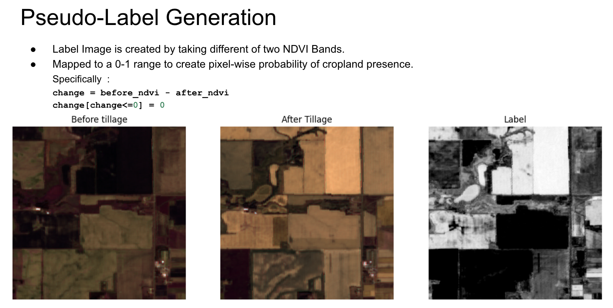
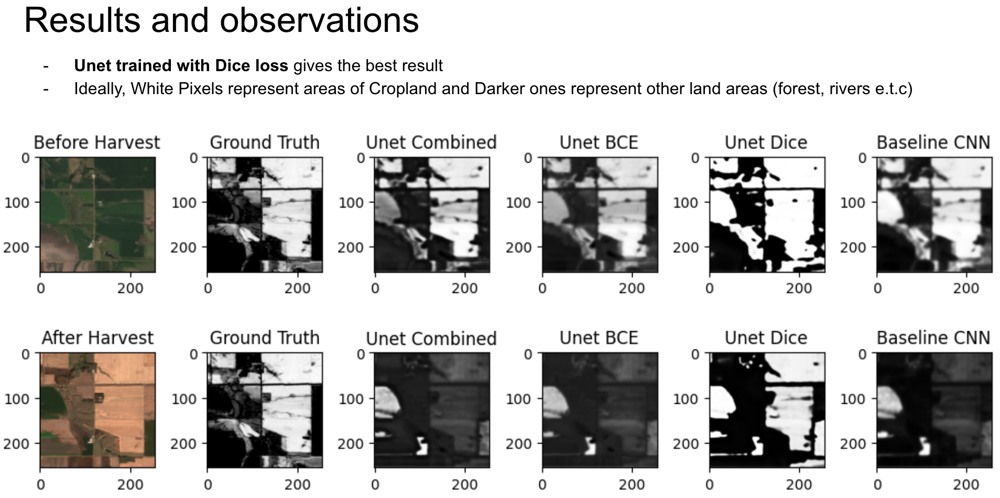
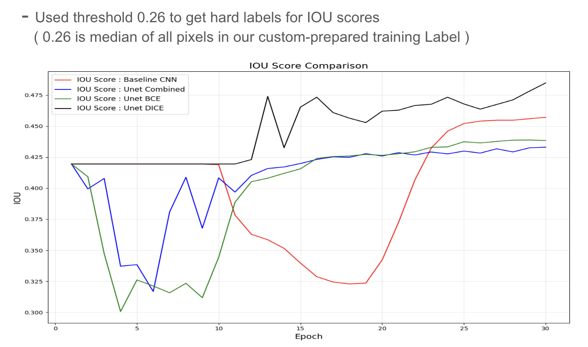

## Introduction
Computer Vision Project for USD class `Computer Vision CSC 752 -UT1`

The project details can be found at : 
`https://github.com/robinnarsinghranabhat/Data-Efficient-Cropland-Segmentation-with-Pseudo-labels/blob/main/CV_Report.pdf`

## Downloading the Sentinel-2 Images
You need to login to Google Earth Engine Explorer, and use the JS files in :  `./gee/`
1. `ee.js` prepares the Export Files to be downloaded. We have two 27-channel image files on a provided region. 
Note : For a larger region, multiple files are downloaded into google drive which must be merged.

2. You can select the region of your choice, or use the coordinates used in `./gee/final_roi.js`

## Notebooks
Refer
- `segmentation_v1.ipynb` : train the baseline model
- `segmentation_unet_dic.ipynb` :  train Unet model with dice loss
- `segmentation_unet_bce.ipynb` : train Unet model with Binary cross entropy loss
- `inference.ipynb` : Compares different trained models againts each other

## Results
### Generating False Labels

### Performance of different variants

### IOU Score comparisons 

